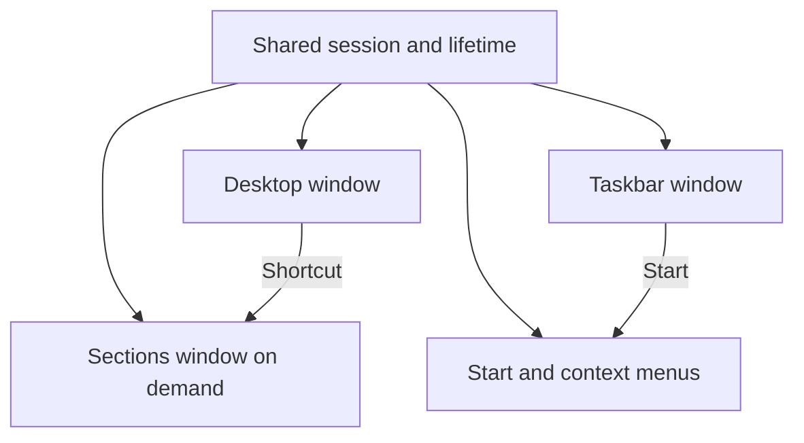

# Nexus 1.2.0 desktop foundation

The desktop is now the environment, and Sections is an application within it. The warm reference-inspired styling remains, but the former full-window collection of navigation, wallpaper, widgets, menus and dock no longer owns the entire shell.

## Ownership

| Piece | Owns | Created | Closing behavior |
|---|---|---|---|
| `DesktopWindow` / `DesktopSurface` | Wallpaper, desktop icon grid, shortcut selection | Startup | Explicit desktop close stops the environment |
| `TaskbarWindow` / `TaskbarView` | Appbar reservation, Start/search, pins, running windows, clock | Startup | Explicit taskbar close stops the environment |
| `MenuWindow` / `StartMenuView` | Start search and launcher list | First Start/search action | Hides on deactivation or Escape; a closed menu can be recreated |
| `DesktopMenus` | Context-menu commands, using WinUI popup flyouts | On demand | Dismissal has no effect on other windows |
| `MainWindow` (Sections) | Section navigation, Explore, Study, app library, workspaces, PC controls | Desktop shortcut, Start or an explicit tool action | Pauses focus, detaches its snapshot provider and releases its controls |
| `ShellSession` | Shared state, snapshot capture and ordered settings writes | Once per environment | Finalizes only when the environment exits |
| `DesktopEnvironment` | Coordinating lifetimes, shared theme, tray/hotkey, periodic window/usage sampling | Startup | Releases native hooks and appbar work area, closes windows, then saves final state |

Each native Window has its own HWND and UI root. They share one WinUI process and UI thread. Separate windows establish independent ownership and presentation; they do not provide separate-process crash isolation.

## Desktop behavior

Startup creates the desktop and taskbar only. The desktop reads the user's and shared Windows desktop folders without modifying them. Sections, My files and Recycle Bin are always present; discovery displays at most 64 external items and limits each directory scan to 512 entries before sorting. Shortcuts use the shipped category illustrations rather than extracted executable logos. This is a launcher foundation, not a new file manager: rename, drag/reorder, delete, selection rectangles and live folder watching are future work.

The desktop remains below ordinary application windows and above the detected Explorer desktop host through standard Win32 positioning and a retained native subclass callback. It does not send a private WorkerW-creation message, reparent Explorer, inject code or stop Explorer. Explorer desktop hosting can differ by Windows version, so this placement must be accepted on actual Windows before shipping.

The taskbar registers through `SHAppBarMessage`, asks Windows for its usable edge rectangle, applies the adjusted reservation, and unregisters before closing. Fullscreen notifications lower the bar and restore its normal stacking afterward. Explorer restart re-registers it. The existing Windows taskbar remains available; Nexus therefore reserves an additional strip above it. This version uses one desktop/taskbar monitor, not a synchronized layer on every monitor or virtual desktop.

Start appears above the taskbar, with its bounds clamped to that monitor and DPI. Search, Down, Enter and Escape support keyboard use. Taskbar icons launch pins or return to visible application windows, while Sections gets its own running button. Show desktop invokes Windows' desktop toggle and then makes the Nexus layers visible without activating them.

## Shared data and smoothness

Sections reuses the session's existing state and app-discovery task. Explicit library refresh can renew completed discovery. No tools or configured workspaces launch merely because Nexus starts. Focus checkpoints are captured on the UI thread, notes retain their existing file format, and queued worker saves operate on independent snapshots. Settings, notes, favorites, workspaces, history, moods and opt-in tracking are preserved.

Background window discovery does not overlap itself and refreshes every five seconds. Appearance is reapplied only when relevant values change; ordinary note edits do not rebuild wallpaper gradients or repeatedly reposition the taskbar. Pin/running-button rows rebuild only when their data changes, and unloading releases motion handlers. Custom motion stays finite and follows reduced-effects and Windows animation settings. Performance and actual input still need measurement on Windows.

## Visual direction

The desktop intentionally has room around icons. Sections receives its own chrome and quiet sidebar. Start is a bounded launcher panel, rather than another section of a full-screen dashboard. The existing Solstice/Ember orange palette and original icons provide continuity across the separate surfaces. The layout illustrations show intended composition using exported runtime colors and source wallpaper paths; they are not proof of native glass or rendering.

## Primary implementation references

- [WinUI multiple windows](https://learn.microsoft.com/en-us/windows/apps/develop/ui/multiple-windows)
- [Application desktop toolbars](https://learn.microsoft.com/en-us/windows/win32/shell/application-desktop-toolbars)
- [SHAppBarMessage](https://learn.microsoft.com/en-us/windows/win32/api/shellapi/nf-shellapi-shappbarmessage)
- [Shell.ToggleDesktop](https://learn.microsoft.com/en-us/windows/win32/shell/shell-toggledesktop)

See TEST-DESKTOP-FOUNDATION.md for the required native review.
